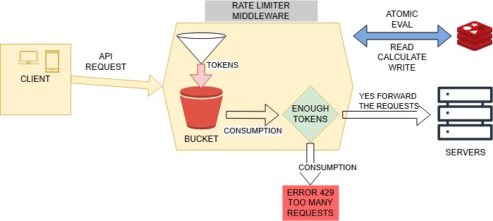

# Distributed Rate Limiter (Token Bucket)

A highly scalable, distributed rate limiter built with Node.js, Express, and Redis. It implements a precise, continuously refilling **Token Bucket algorithm** evaluated entirely inside Redis using atomic Lua scripts.

## 🏗 Architecture Diagram



## 🚀 Features

- **Distributed & Scalable:** State is stored in Redis, meaning the rate limits apply perfectly across multiple instances of your Node.js servers (e.g., behind a load balancer).
- **Atomic Lua Scripts:** Race conditions are eliminated by evaluating the Token Bucket logic within a single, atomic Redis `EVAL` script.
- **Continuous Millisecond Refill:** Instead of jarring "fixed-window" resets (like resetting all limits at midnight), tokens continuously drip back into the user's bucket down to the millisecond.
- **Variable Request Costs:** Different endpoints can drain different amounts of tokens. A standard `/ping` might cost 1 token, while generating a massive report could cost 3 tokens.
- **Dynamic Profiles:** Easily configure multiple profiles (e.g., `strict`, `standard`, `premium`) for different user tiers or endpoints.
- **IP Whitelisting:** Built-in support to entirely bypass rate limiting for trusted IPs (e.g., your own microservices or admins).
- **Standard HTTP Headers:** Automatically injects industry-standard rate-limit headers (`X-RateLimit-Limit`, `X-RateLimit-Remaining`, `Retry-After`) into responses.

## 🛠 Prerequisites

- **Node.js** (v20+ recommended)
- **Redis** server running locally or via cloud (e.g., Redis Labs, ElastiCache)

## 📦 Installation

1. Clone the repository and navigate to the project root.
2. Install dependencies:
   ```bash
   npm install
   ```
3. Create a `.env` file in the root directory (you can copy `.env.example` if available) and configure your variables:

   ```env
   PORT=3000
   REDIS_HOST=127.0.0.1
   REDIS_PORT=6379
   REDIS_TIMEOUT=2000

   # Default 'Standard' Limiter settings
   BUCKET_CAPACITY=10
   BUCKET_REFILL=1
   BUCKET_TIMEOUT=5000

   # Comma separated list of IPs to bypass rate limits
   WHITELIST_IPS=127.0.0.1,::1
   ```

4. Start the development server:
   ```bash
   npm run dev
   ```

## 🧠 How the Token Bucket Works

The rate at which a user gets their requests back is determined by this formula:  
**Time for 1 Token = `timeout / refill`**

For example, if you set:

- `capacity: 5` (Max burst of 5 requests)
- `refill: 5`
- `timeout: 10000` (10 seconds)

The user regenerates `5 / 10000` tokens per millisecond. This equals **1 token every 2 seconds**. If a user has 0 tokens, they simply wait 2 seconds to be allowed to make 1 more request.

## 💻 Usage & Routing

The rate limiter middleware is highly flexible. You can define custom limiters in your middleware file and apply them to specific Express routes.

```javascript
const { createRateLimiter } = require('./middlewares/ratelimitter.middleware');

// 1. Standard Limiter (pulls capacity/refill/timeout from .env)
const standardLimiter = createRateLimiter({ label: 'standard' });

// 2. Strict Limiter (Hardcoded: max 5 requests, refills 5 every 10s)
const strictLimiter = createRateLimiter({
  label: 'strict',
  capacity: 5,
  refill: 5,
  timeout: 10000,
});

// 3. Heavy Route (Costs 3 tokens per request instead of 1)
const heavyLimiter = createRateLimiter({
  label: 'heavy',
  cost: 3,
});

// Apply to routes
router.get('/ping', standardLimiter, controller.publicEndpoint);
router.post('/login', strictLimiter, controller.loginEndpoint);
router.get('/heavy-task', heavyLimiter, controller.heavyEndpoint);
```

## 📡 HTTP Response Headers

When a user hits an endpoint protected by the rate limiter, they will see the following headers:

- `X-RateLimit-Limit`: The total bucket capacity.
- `X-RateLimit-Remaining`: How many tokens the user has left.
- `X-RateLimit-Policy`: Describes the algorithm, label, and cost (e.g., `token-bucket; profile=strict; cost=1`).

If a user exhausts their bucket, they receive a `429 Too Many Requests` response along with a `Retry-After` header indicating the number of seconds until they have enough tokens to try again.

## 🛡 Whitelisting / Testing Locally

By default, `127.0.0.1` and `::1` might be whitelisted in your `.env`. If you want to test rate-limiting against yourself locally via Postman:

1. Temporarily remove your local IP from the `WHITELIST_IPS` in `.env`.
2. OR: Because Express is set to `trust proxy`, you can inject an `X-Forwarded-For: 192.168.1.5` header in your Postman request to spoof a remote user.
